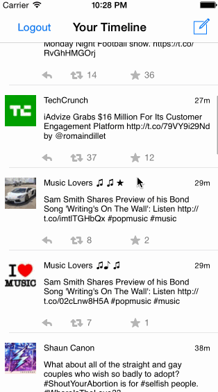

## Twitter Redux

Time spent: 13 hours

### Features

#### Required

 * [x] Dragging should reveal hamburger menu
 * [x] Hamburger menu should include links to your profile, home timeline, and mentions
 * [x] Profile page should contain header view and basic user stats (# tweets, # following, # followers)
 * [x] Tapping avatars should bring up that user's profile page

#### Optional

I did not perform any optional features.

### Walkthrough

